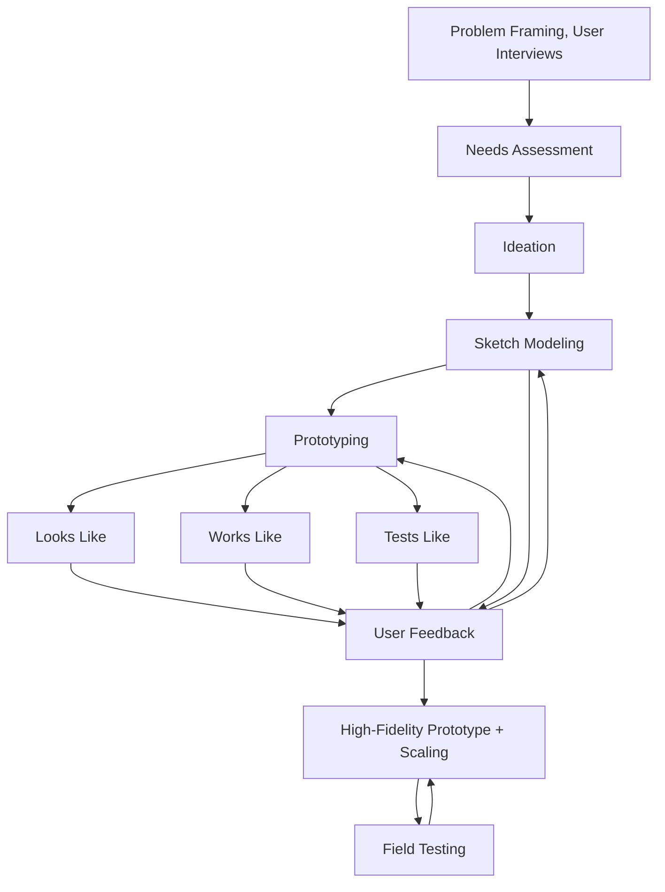
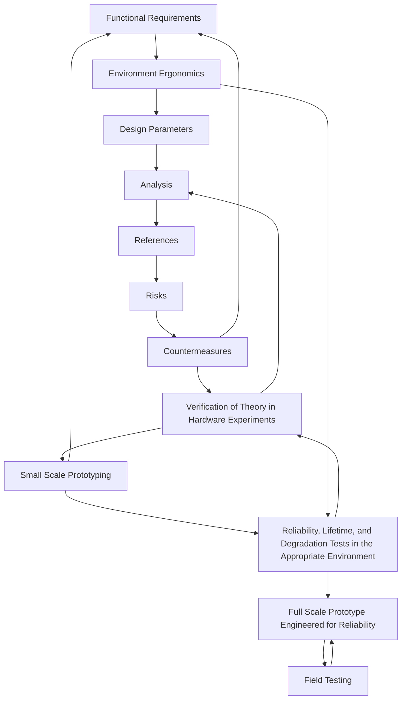
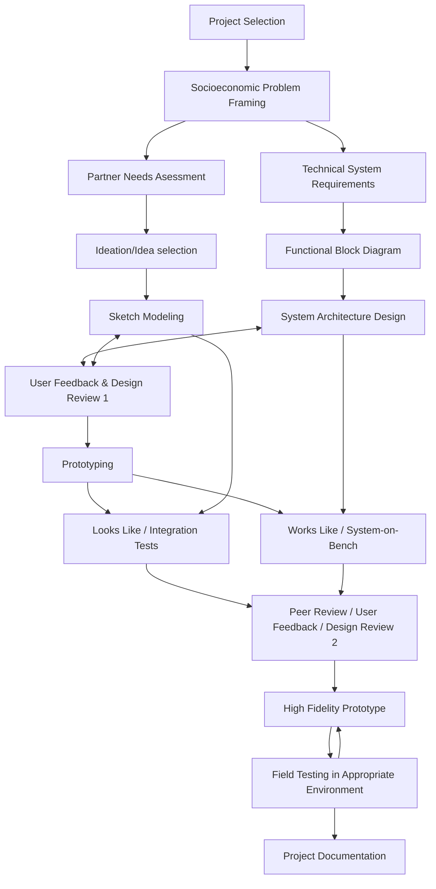

Hello! And welcome to the documentation website for **EC.751 / EC.793 (G) Hardware Design for the Developing World**! This class is focus on applying the concepts of upcycled electronics, electrical design, remote sensing and monitoring, and mechatronics to problems related to the [UN Sustinable Development Goals ↗](https://sdgs.un.org/goals) with D-Lab partners around the world. This includes exploring applications to health, energy, education, and agriculture to have a positive impact on people living in low-income and under-served communities around the world. This class is offered in conjunction with the MIT D-Lab program [Design for Second-Life Innovations ↗](https://d-lab.mit.edu/innovation-practice/design-second-life-innovations).


  
  


See the link below for a PDF of the syllabus!



## Contents of this Website

Please note that if you're an actively enrolled student **you must also have access to the canvas website to recieve announcements, submit assignments, and more.** We will be using canvas for managing grades, assignments, and general course logistics. This site is focused on documentation.

As you will be creating complex mechatronics systems with your community partners abroad, it's essential you and your partners both have access to adequate technical information to build your skillsets together. This website was designed to consolidate the hardware and software documentation required for the course in a place where both you and your community partners can access it easily. This includes the following:

- Basic information on using sensors, actuators, arduino and the arduino cloud, connecting with smartphones, and data management. 
- Considerations on designing electronic systems for remote environments.
- Consolidated readings on electrical design, safety, and mechatronics. 
- Links to great educational resources including textbooks, youtube channels, free software, and other courses.
- Public documenations on the labs and tutorials.

Additionally, the content on this website is [released open-source under creative commons ↗.](https://creativecommons.org/licenses/by/4.0/) So it can be shared with anyone! 

## Combining Design and Technical Education

This is a unique class for both MIT as well as D-Lab because of our focus on combining two, generally independent streams of though to build robust products for harsh environments while considering our users needs, and socioeconomic contexts. We call it **technically rigorous product design for developing contexts.** 

Here's what the product design process generally looks like. It's a little messy, but there's always a lot of feedback:

And here's what the engineering design process generally looks like (see [FUNdaMENTALs of Design by Alex Slcoum ↗](https://meddevdesign.mit.edu/fundamentals-downloads/?eeFolder=FUNdaMentals-Chapters)). It's also worth looking at the [NASA Technology Readiness Levels (TRLs) ↗](https://www.nasa.gov/directorates/somd/space-communications-navigation-program/technology-readiness-levels/):

In this class we're going to combine these two processes into one, and also apply it to mechatronics / IoT systems in developing world contexts. We're still developing this concept, but that process is going to look something liks this.

## Class FAQ

{}

If you attend either Harvard or Wellesley, you **may cross register for this class.** Please check with your specific school/department on instructions for cross registering, and please email the instructors to check class avaliability! 

{}

{}

Note that this course is *designed to teach you technical content,* so not having a background in electronics does not necessarily disqualify you from taking this course. However, it is important to note that this class is technical, and we will be posting a number of resources for you to take advantage of to get up to speed on the technical content. However, a short list of things to become familiar with before taking the course might be:

- Arduino wiring and programming (basic)
- Introductory electronics, ohm's law, KVL, KCL, voltage and current rating of components, series and parallel combinations
- Basic circuit components, voltage dividers, potentiometers, transistors, op-amps, ADCs/DACs, relays

**Don't be scared! We will post a number of resources for you to get caught up on these!**

**Advanced content.** Please note that if you're a student that has ample experience in electrical design, this course is STILL worth taking. We want to offer resources that help you learn considerations for designing electrical systems for developing contexts. This includes PCB design, selecting components to avoid supply chain issues, selecting components to minimize cost while maintaining robustness and functionality, and more. Please email us for more info! 

{}

{}

Please note that as of the 2024 Spring version of this course, we do not currently have access to the D-Lab shop. This is due to high demand, and because this class is running as a pilot program for the first semester. Please let your instructors know if you have fabraction needs that include 3D Printing, Welding, CNC Machining, or other forms of fabrication ASAP so we can get you access to the right resources. **Please note that shop safety training is your responsibility for 2024.**

{}

{}

We take safety in this class seriously, especially in the world of electronics. Note that according to OSHA, most electrical systems under 50V DC are considered safe to use with minimal precautions. However, we may exercise increased precaution in this class beacuse some students may be less familiar or comfortable around electronics systems. **Our policy, in general, is if you're unsure please ask before doing anything. Electronics is hard, and unintuitive, so it's better to ask than to hurt yourself.**

{}

## Special Thanks To

Special thanks goes to Libby McDonald, Nancy Adams, Libby Hsu, Ana Pantelic, Dan Sweeney, and the rest of the amazing people at MIT D-Lab. An additional thank-you goes out to our community partners Twende (Tanzania), Kulika Uganda, and Youth Social Advocacy Team (Uganda, South Sudan). Finally, a special thanks goes to the [Korean International Cooperation Agency (KOICA) ↗](https://www.koica.go.kr/koica_en/3459/subview.do) for supporting this work.

