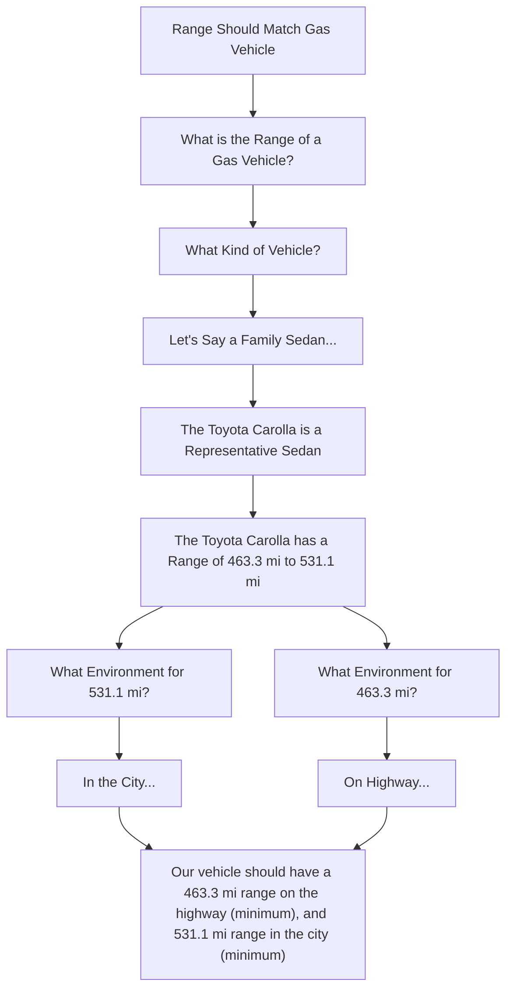
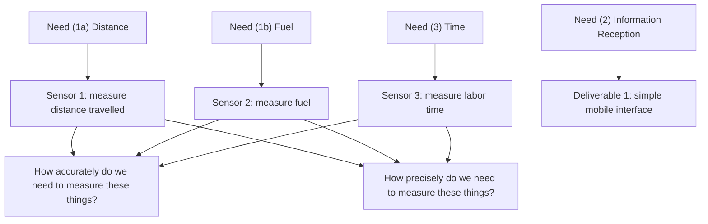
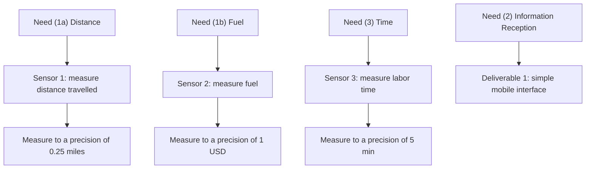
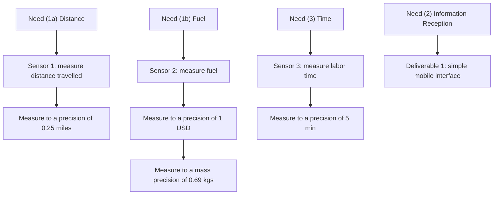
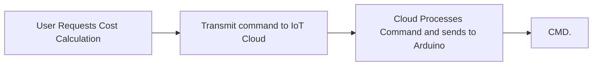
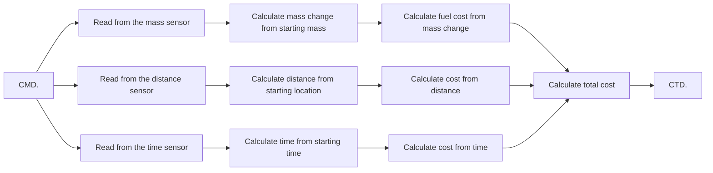
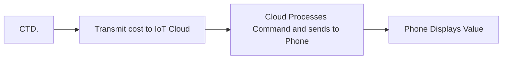

The question we're going to ask ourselves in this reading goes back to the diagrams we presented in class and on the [about page](../../../about/#combining-design-and-technical-education) of this website: *how do we combine the traditional product design process and co-creation process with the engineering design process to build robust systems?* To do this, I'm going to take a completely arbitrary example of a system, and walk you through developing funcational requirements based on "pain points" the user identified when you conducted a needs assessment.


  **Functional Requirements** are very similar to what we might call *design requirements* as they basically list out what our system has to do. However, in engineering, our focus is relability. We ask the question *how can I make sure this system works every time and in the same way?* and in this sense we need a concrete way to dicuss our requirements. We need to ground them in something, and this something is numbers. In that sense, **a functional requirement is a design requirement that you've assigned a number and a unit to.**


So let's talk about an example of functional requirments. Let's say I'm designing an electric vehicle and the customer might say *"well the range needs to be just as long as a gasoline vehicle because I don't want to stop more for electricity than I do for gas, that's annoying."* As engineers, we need to translate that to a number so this is what that might look like. 

In table form, which is how we write most functional requirements, this is how we might represent this. 

| **Parameter** | **Value** | **Unit** | **Conditions** |
|--|--|--|--|
| Range (highway) | 463.3 | mi | on the [US EPA HWFET Drive Cycle](https://www.epa.gov/vehicle-and-fuel-emissions-testing/dynamometer-drive-schedules) |
| Range (city) | 531.1 | mi | on the [US EPA UDDS Drive Cycle](https://www.epa.gov/vehicle-and-fuel-emissions-testing/dynamometer-drive-schedules) |

Notice how we assign both **a target number to hit** as well as **a test procedure that's based in science.** That way we know that the system achieves what we want it to, and we have an accurate standard of comparison. If you don't know what a 'drive cycle' is, it's a standard way of testing range that we use for all kinds of vehicles (basically we drive them the same way so we can compare them). Now let's take a look at an example of this for an IoT system in a developing world context. 

### Developing Functional Requirements (FRs)

Let's take the example of this fun little donkey-pulled irrigation cart. The idea here is that there's a cart with a water pump on it, and it gets pulled by a Donkey, and it moves from farm to farm to help farmers pump water into their fields. The pump hooks up to the wells farmers already have, and irrigates their fields without manual labor. The pump is powered by gasoline. Your user is the pump operators who want to ensure they're being paid fairly for their time, the gas they use running the pump, and the distance they have to travel to get from their home to the farm where they will be pumping. **Note, the water pump in this situation runs on gasoline the user needs to pay to re-fill.**

#### Identifying User Needs

We interviewed the user, and we identified the following "needs" and pain points. Note these are a little "direct" and generally you'll have to do more work to get this information out of your consumers. In addition, right now we're just thinking about cost to operate the pump and the travel time. We aren't considering food and water for the donkey, if it's raining, or similar environmental factors. But for argument sake, let's simplify the problem.

| **Identifier** | **Question** | **Identified User Need** |
|--|--|--|
| Need #1 | Q: "How do you charge the customer?" | A: "We charge based on how far we have to travel, and how much fuel we use pumping the water." |
| Need #2 | Q: "How do you want to recieve the information?" | A: "We want a phone app that just tells us how much money to charge the customer." |
| Need #3 | Q: "Do you care how much time you spend somewhere?" | A: "Yes, the more customers we visit, the more money we can make." |

*Note, you might split need (1) into need (1a) "travel distance" and (1b) "fuel use" as it really is two seperate needs.*

#### Developing a Flow Chart

So as engineers, we might start to make a little flow chart for our system starting with the users needs and trying to explore possible paths to fulfill them.

Quickly, however, we run into a question. There are many ways to measure things like time, fuel, distance, and other parameters. There's many kinds of sensors that can output the information. But how do we pick? This is where we start to use numbers because we ask the question how *accurately* and *precisely* do we need to measure these variables. If you need a refresher, here is one below.

#### Returning to the User with Questions

Now we might go back to our user and start to ask certain questions. Again, simplified for brevity.

| **Identifier** | **Question** | **Identified User Need** |
|--|--|--|
| Need #4 | Q: "How do you charge for time?" | A: "We charge an hourly rate, but I don't want to waste more than 5 minutes of my time." |
| Need #5 | Q: "How much money are you OK wasting on fuel?" | A: "We don't want to waste more than 1 dollar on fuel." |
| Need #6 | Q: "How do you charge by distance?" | A: "We charge by the mile, but we don't want to travel more than 0.25 miles farther than we need to." |

#### Accuracy vs. Precision in Sensing

Now we might start thinking about a "specification" we can apply to the sensors we're going to choose. But we need to split this into precision, and accuracy. Now here's where it gets a little tricky. We are measuring the following:

- *the time it took to irrigate the field*
- *the distance the cart travelled to get to the field*
- *the total amount of fuel used*

I'm going to make a claim, and I want you to think about it's implications. 


  **All of these measurements are taken by taking a measurement, and subtracting it from an original measurement.** We are calculating $X_{final}-X_{initial}$, which means **we don't care about the actual value of** $X$. We just care that the *difference in the values is accurate.* **So our sensors can be inaccurate as long as they're precise.**


Let's think of this in another way:
- I start walking from point A to B at 1:00 PM
- I take a sensor reading, the sensor says it's 1:05 PM (100% precision is at 1:00 it always reads 1:05)
- I arrive at B at 1:40 PM
- I take a sensor reading, the sensor says it's 1:45 PM (100% precision is at 1:40 it always reads 1:45)

Since 1:45 - 1:05 = 1:40 - 1:00, I don't necessarily care about the value of the time, just that the sensor is precise enough to resolve the different. Now let's say my sensor is im-precise AND inaccurate. (So at 1:00, 50% of the time my sensor reads 12:50, and the other 50% of the time it reads 1:00).

This time:
- I start walking from point A to B at 1:00 PM 
- I take a sensor reading, the sensor says it's 1:00 PM
- I arrive at B at 1:40 PM
- I take a sensor reading, the sensor says it's 1:30 PM

*Now* the difference in time that we read is 30 minutes. But I walked for 40! Those fiends! They're trying to under-charge me! We're going to explore this more in the next reading, but in general you need to think about this for all of your sensors. In the case of this class, **often times we'll care more about precision than accuracy.**

#### Updating our Chart with Numbers

Now we can continue our goofy little chart in our silly little notebooks.

#### Calculating Functional Requirements

Now let's take this one step further and think about how we might measure these. We can use a GPS or wheel encoder to measure distance, and we can use a clock to measyre time. The GPS outputs units of miles, the clock outputs units of time, so we're OK there! **But how do we measure fuel?** Here are some options. 

- We can measure the *volume* of fuel in the gas tank *before* and *after* we run the pump. 
- We can measure the *depth of fuel* in the tank *before* and *after* we run the pump. 
- We can measure the *weight* of the gas tank *before* and *after* we run the pump. 

In the first option. We would have to measure the volume of fuel we put in, and the pour it out again to measure the volume in a beaker or something. Not efficient. In the second, we could use the level, but unless the gas tank is a perfect cylinder, or square, how do we translate that to a quantity of fuel that we would buy? That modeling might be more complicated than is worth. **The last option is the best one here because if we measure the difference in weight we know the weight of fuel we would need to buy AND we don't need to remove the fuel from the tank to weigh it.**

$$W_{measured} = W{tank} + W{fuel}$$
$$W_{measured_i} = W{tank} + W{fuel_i}$$
$$W_{measured_f} = W{tank} + W{fuel_f}$$
$$\Delta W_{measured} = (W{tank} + W{fuel_f}) - (W{tank} + W{fuel_i})$$
$$\Delta W_{measured} = W{fuel_f} - W{fuel_i}$$

So we can just put a weight sensor under the tank! 

**But we still have a problem.** Let's say we measure the weight *before* and *after* we get a difference of mass of fuel in (kg) or (lbs). *But how precise does this sensor have to be?* Our specification **is in USD the consumer doesn't want to waste.** Here's how you'd translate that. 

First, calculate the gallons of fuel that *1 USD can purchase.* Let's say a gallon of gas is 4 USD.

$$G_{fuel} = \frac{C_{waste}}{C_{gallon}}$$
$$G_{fuel} = \frac{1.0}{4.0} = 0.25 gal$$

This means we need to measure *with a precision* at most 0.25 gallons of gas. **But our sensor measures (kg) not gallons!** Hmmmmmmmmmmmmmm. Ok, do we know the weight of a gallon of gas? YES! This number is called the density. A gallon of gas weighs 2.7546665 kg. So we can use this number!

$$0.25 gal * 2.75 kg/gal = 0.6875kg$$

So what did we just calculate? Well if we want to waste at most 1USD of money, that is equivalent to being "wrong" in our measurement by 0.25 gallons. 0.25 gallons of gas weighs 0.69 kgs. So our *weight sensor must measure the mass of gas to 0.69 kgs.* This is our specification on precision.

In both [Reading 3](../reading3) and in [Lab 2](../../labs/lab2) we will talk more about how to select a specific sensor based on the "precision" we need. But for now, we've come up with some basic functional requirements to start. 

| **Identifier** | **Requirement** | **Number** | **Unite** |
|--|--|--|--|
| FR1 | Distance Measurement Precision | 0.25 | miles |
| FR2 | Fuel Mass Measurement Precision | 0.69 | kgs |
| FR3 | Time Measurement Precision | 5 | min |

#### Top Level Functional Requirements

Note this is just the *first layer* of functional requirements we might write for a system. A real complete list of functional requirements usually is hierarchical, and can have hundreds and thousands of requirements all based on the needs of that particular system. In this case we'll assign just a few more such as the total cost of the system, and how fast we want the phone app to update. 

| **Identifier** | **Requirement** | **Number** | **Unite** |
|--|--|--|--|
| FR1 | Distance Measurement Precision | 0.25 | miles |
| FR2 | Fuel Mass Measurement Precision | 0.69 | kgs |
| FR3 | Time Measurement Precision | 5 | min |
| FR4 | System Total Cost | 100 | USD |
| FR5 | Update Time | 2 | min |

#### Hierarchical Functional Requirements, Layer 2 Example

The above numbers could have come from talking to the user but we glossed over those details for now. Let's go one deeper into the functional requirements and understand how to break down the "Update Time" requirement which is the time between the user asks the app to calculate the cost, and when it actually presents the cost to the user on the GUI. First, let's list the steps the system needs to take to calculate a cost.

Now this is a complicated process, and each step takes time. There are things we have control over and things we don't have control over. For example, the time it takes to process commands in IoT cloud and transmit data back and forth from arduino to cloud, and cloud to phone are *out of your control* and depend on the network connection in the area (how many megabits per second can we transfer MB/s). [Here's a good FAQ on internet speed tests](https://www.speedtest.net/about/knowledge/faq). Things like how fast it takes the arduino to calculate something, or how fast it'll read data for a sensor are *also mostly out of your control* but importantly, they are **fixed, and known** and you can find that out by looking up the specifications of an arduino (these tables are shown below for reference). But based on how you write your code, you might have control on how fast the code on the arduino runs! That's something you can control, and maybe based on the user specifications, the latencies in your system, and the computational limits of the arduino, you might want to write a functional requirement on how fast your code needs to run! 

$$T_{code} = T_{user} - T_{internet} - T_{calculation}$$

Essentially, your code needs to run faster than the difference between the total alotted time, and all the times that are out of your control. If $T_{code}$ ends up negative (or at an impractically small value), you might need to change the hardware to get faster computation time, change the network to get faster speed, or have a conversation with your user about feasibility! But this way you KNOW, and you're not guessing! 

**And that's your basic intro to functional requirements!!! Let us know if you have questions!!!**

### Reference Tables on Arduino Timings

